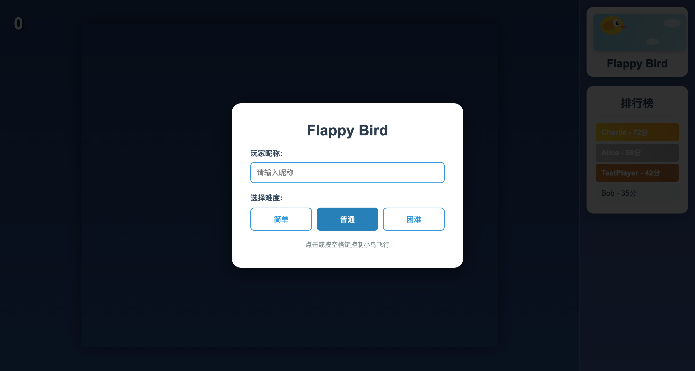
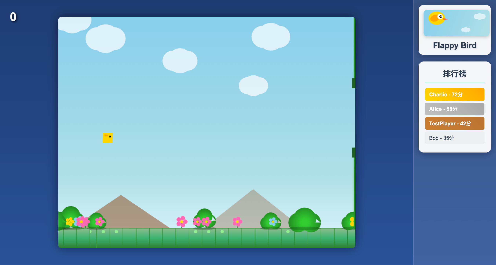
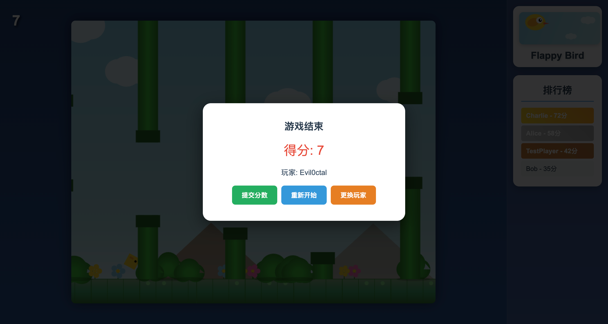

# 🐦 Flappy Bird 游戏

一个使用 Python FastAPI 后端和 HTML5 Canvas 前端实现的经典 Flappy Bird 游戏，支持在线排行榜、多难度模式和精美的游戏画面。


## 📸 游戏截图

<div align="center">

### 游戏开始界面


*输入昵称，选择难度，开始游戏*

### 游戏进行中


*躲避管道，获取高分，实时排行榜显示*

### 游戏结束界面


*查看最终得分，提交到排行榜或重新开始*

</div>

## ✨ 功能特点

- 🎮 **经典玩法**：还原经典 Flappy Bird 游戏体验
- 🎨 **精美画面**：动态背景、云朵、山脉、花草等装饰元素
- 🎵 **游戏音效**：使用 Web Audio API 生成跳跃、得分、碰撞音效
- 📊 **排行榜系统**：实时更新的在线排行榜，支持前三名特殊标记
- 🎯 **难度选择**：三种难度模式适合不同水平的玩家
- 📱 **响应式设计**：自适应不同屏幕尺寸，支持移动设备
- ⏱️ **倒计时开始**：3秒倒计时准备时间
- 🎪 **流畅动画**：60FPS 流畅游戏体验

## 🛠️ 技术栈

### 后端
- **Python 3.8+** - 编程语言
- **FastAPI** - 现代高性能 Web 框架
- **SQLAlchemy** - ORM 数据库工具
- **SQLite** - 轻量级数据库
- **Uvicorn** - ASGI 服务器
- **Pydantic** - 数据验证

### 前端
- **HTML5 Canvas** - 游戏渲染
- **JavaScript (ES6+)** - 游戏逻辑
- **CSS3** - 界面样式
- **Web Audio API** - 音效系统

## 🚀 快速开始

### 环境要求
- Python 3.8 或更高版本
- pip 包管理器

### 安装步骤

1. **克隆项目**
```bash
git clone https://github.com/yourusername/FlappyBird.git
cd FlappyBird
```

2. **创建虚拟环境（推荐）**
```bash
python -m venv venv
# Windows
venv\Scripts\activate
# macOS/Linux
source venv/bin/activate
```

3. **安装依赖**
```bash
pip install -r requirements.txt
```

4. **运行游戏**
```bash
python run.py
```

游戏将自动在默认浏览器中打开，访问地址：http://localhost:8000

## 🎮 游戏操作

### 控制方式
- **鼠标**：点击游戏画布让小鸟跳跃
- **键盘**：按空格键控制跳跃

### 游戏流程
1. 输入玩家昵称（最多20个字符）
2. 选择游戏难度
3. 等待3秒倒计时
4. 开始游戏，控制小鸟穿过管道
5. 游戏结束后可提交分数到排行榜

## 🎯 难度说明

| 难度 | 重力 | 跳跃力 | 管道速度 | 管道间隙 | 说明 |
|------|------|--------|----------|----------|------|
| 简单 | 0.15 | -4.5   | 1.2      | 180px    | 适合新手玩家 |
| 普通 | 0.18 | -5.0   | 1.8      | 150px    | 标准游戏体验 |
| 困难 | 0.22 | -5.5   | 2.5      | 130px    | 挑战高手玩家 |

## 📁 项目结构

```
FlappyBird/
├── backend/                 # 后端目录
│   ├── __init__.py         # 包初始化文件
│   ├── main.py             # FastAPI 主应用
│   ├── api.py              # API 路由定义
│   ├── models.py           # SQLAlchemy 数据模型
│   ├── schemas.py          # Pydantic 数据验证模型
│   ├── database.py         # 数据库连接配置
│   └── score.db            # SQLite 数据库文件（自动生成）
├── frontend/               # 前端目录
│   ├── index.html          # 游戏主页面
│   ├── game.js             # 游戏核心逻辑
│   ├── style.css           # 界面样式
│   ├── leaderboard.js      # 排行榜功能
│   └── logo.js             # Logo 和图标生成
├── docs/                   # 文档目录
│   └── screenshots/        # 游戏截图
│       ├── start-screen.png    # 开始界面
│       ├── gameplay.png        # 游戏画面
│       └── game-over.png       # 结束界面
├── run.py                  # 游戏启动脚本
├── requirements.txt        # Python 依赖列表
├── LICENSE                 # MIT 许可证
└── README.md              # 项目说明文档
```

## 🔧 配置说明

### 后端配置
- 默认端口：8000
- 数据库：SQLite（自动创建）
- CORS：允许所有来源（开发环境）

### 前端配置
- Canvas 最大尺寸：900x700px
- 排行榜更新间隔：30秒
- 支持的浏览器：Chrome、Firefox、Safari、Edge

## 📊 API 接口

### 提交分数
```
POST /api/submit_score
Content-Type: application/json

{
  "name": "玩家昵称",
  "score": 100
}
```

### 获取排行榜
```
GET /api/leaderboard
返回前10名玩家数据
```

## 🐛 常见问题

1. **端口被占用**
   - 修改 `run.py` 中的端口号
   - 或关闭占用 8000 端口的程序

2. **数据库错误**
   - 删除 `backend/score.db` 文件
   - 重新运行程序自动创建

3. **依赖安装失败**
   - 确保使用 Python 3.8+
   - 尝试升级 pip：`pip install --upgrade pip`

## 🤝 贡献指南

欢迎贡献代码、报告问题或提出新功能建议！

1. Fork 本仓库
2. 创建特性分支 (`git checkout -b feature/AmazingFeature`)
3. 提交更改 (`git commit -m 'Add some AmazingFeature'`)
4. 推送到分支 (`git push origin feature/AmazingFeature`)
5. 提交 Pull Request

## 📝 更新日志

### v1.0.0 (2025-05-26)
- 🎉 初始版本发布
- ✨ 实现基础游戏功能
- 📊 添加排行榜系统
- 🎨 设计游戏界面
- 🎵 添加音效系统

## 📄 许可证

本项目采用 MIT 许可证，详见 [LICENSE](LICENSE) 文件。

## 👨‍💻 作者

- 您的名字 - [GitHub](https://github.com/yourusername)

## 🙏 致谢

- 感谢 FastAPI 提供优秀的 Web 框架
- 感谢所有贡献者的支持

---

如果觉得这个项目不错，请给个 ⭐ Star 支持一下！
